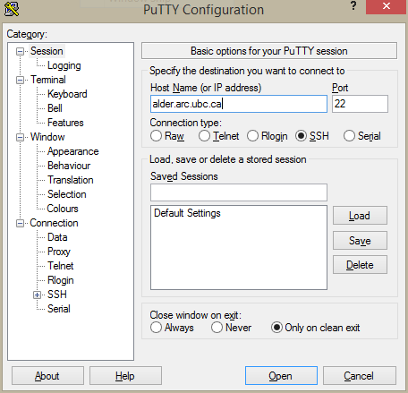
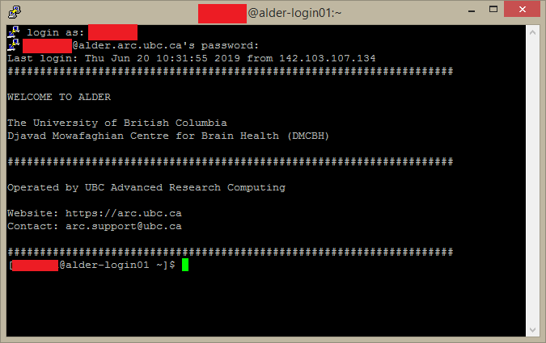

Logging in remotely via SSH
===========================

Linux and MacOS
---------------
Test availability of ssh by entering the following command:

.. code-block:: bash

   $ ssh -V

You should see something like 

.. code-block:: bash
 
   OpenSSH_7.9p1, OpenSSL 1.1.1a  20 Nov 2018

Log into the remote computer

.. code-block:: bash

   $ ssh <username>@<remote computer>

With ``<username>`` replaced with your username on ``<remote computer>``
Input your password and press enter.

Examples
~~~~~~~~
Alder
^^^^^

.. code-block:: bash

   $ ssh <username>@alder.arc.ubc.ca

Compute Canada Clusters
^^^^^^^^^^^^^^^^^^^^^^^

.. code-block:: bash
   
   # cedar (SFU)
   $ ssh <username>@cedar.computecanada.ca

   # graham (U Waterloo)
   $ ssh <username>@graham.computecanada.ca

   # beluga (ETS Montreal)
   $ ssh <username>@beluga.computecanada.ca

Windows
-------

A. Using Git Bash
~~~~~~~~~~~~~~~~~
Download and install `Git Bash <https://git-scm.com/download/win>`_. Once you have it set up, you can use the same process as in the previous section.

B. Using PuTTY
~~~~~~~~~~~~~~
Download and install the latest version of PuTTY from `here <https://www.chiark.greenend.org.uk/~sgtatham/putty/latest.html>`_

Open up PuTTY.
Under the ‘Session’ section, set the Host Name to the appropriate server e.g. ``alder.arc.ubc.ca``, ``cedar.computecanada.ca``, and so on.

Click on Open. This should open up a terminal.
Input your login credentials. 
If the login is successful, you should see something like this:

