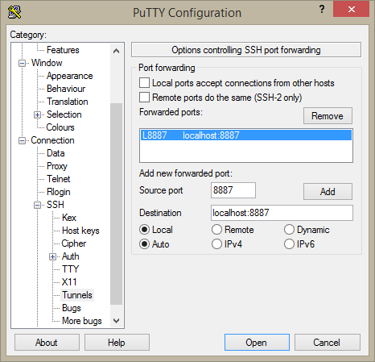

Run Jupyter Remotely
====================

In some instances, you may need to run Jupyter (notebook or lab) on a remote computer to use its resources 
but open the web interface on your local machine.

.. note::
   With the availability of the JupyterHub on Alder, this approach is not recommended. 
   
   It is also not recommended to use this approach on Compute Canada. Prototype interactively elsewhere and run a batch script instead.

Linux and MacOS
---------------
SSH into your computer and activate your desired jupyter python environment.
Start your jupyter server with the following command

.. code-block:: bash

   $ jupyter notebook --no-browser --port=<port on remote computer>

If you prefer to use jupyter lab, use 

.. code-block:: bash

   $ jupyter lab --no-browser --port=<port on remote computer>

Replace ``<port on remote computer>`` with a source port. It is recommended to use a port number greater 
than 8000 so it does not conflict with the ports used for other services.

Copy the token code that appears after ``token=`` 

On your local machine, open another terminal and tunnel into that port.
Replace ``username`` with your alder username.

.. code-block:: bash

   $ ssh -N -f -L localhost:<port on remote computer>:localhost<port on your computer> <username>@<remote computer>

If your remote computer is in your ``~/.ssh/config`` file, you can use:

.. code-block:: bash

   $ ssh -N -f -L localhost:<port on remote computer>:localhost<port on your computer> <host>

Where ``<host>`` is the Host name defined in ``~/.ssh/config``   

Open up a browser and go to ``localhost:<port on your computer>``. 
On the jupyter page that appears, paste your token code into the box and click on ‘Log in’. 
You should now see the usual jupyter notebook/lab interface.

Windows
-------
A. Using Git Bash
~~~~~~~~~~~~~~~~~
Same process as in the previous section.

B. Using PuTTY
~~~~~~~~~~~~~~
Open up PuTTY.
Under the ‘Session’ section, set the Host Name to the address of the remote computer, e.g. ``alder.arc.ubc.ca`` in this case.

.. image:: 1connect.png

Next, expand the SSH tab and click on Tunnel. 
Enter the Source port at which you want to launch the jupyter server on Alder, and the 
Destination port which you would like to use to access the notebook on your machine in the 
format localhost:<port>. Click on 'Add', then 'Open'.

Input your login credentials. If the login is successful, you should see something like this:

.. image:: 3login.PNG

Next, request the resources you would like to use for your notebook session, for instance, th following 
would give you 4 CPU cores and 8000 MB of RAM.

.. code-block:: bash
  
   $ salloc --cpus-per-task=4 --mem-per-cpu=2000m

Where mem-per-cpu is the amount of RAM per cpu in megabytes.

Activate your jupyter python environment e.g.

.. code-block:: bash

   $ source myenv/bin/activate

Where myenv is the environment

Launch the jupyter notebook server on the source port specified earlier e.g. 
if the port was 8887

.. code-block:: bash

   $ jupyter notebook --no-browser --port=8887

If you prefer to work in jupyter lab instead, use this instead

.. code-block:: bash

   $ jupyter lab --no-browser --port=8887

.. image:: 4notebook-server.PNG

Copy the token. 
On your local machine, open a browser and go to the localhost port specified in the 
Destination earlier, e.g. ‘localhost:8887’. You should see a page that looks like this. 
Paste the token you had copied in the previous step into the box and click on ‘Log in’. 
You should then see a typical notebook/lab interface open up.

.. image:: 5logintonotebook.PNG