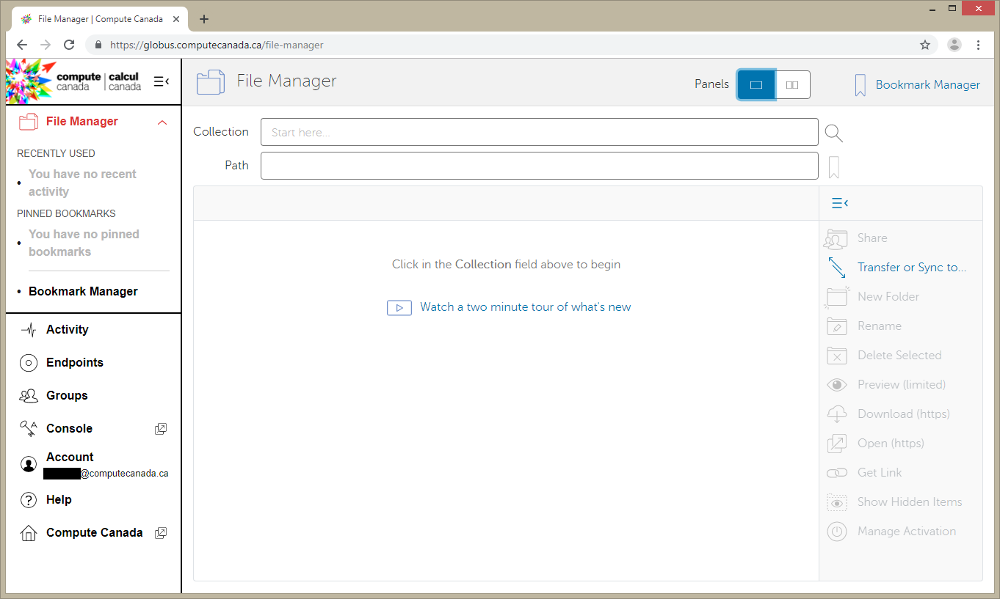
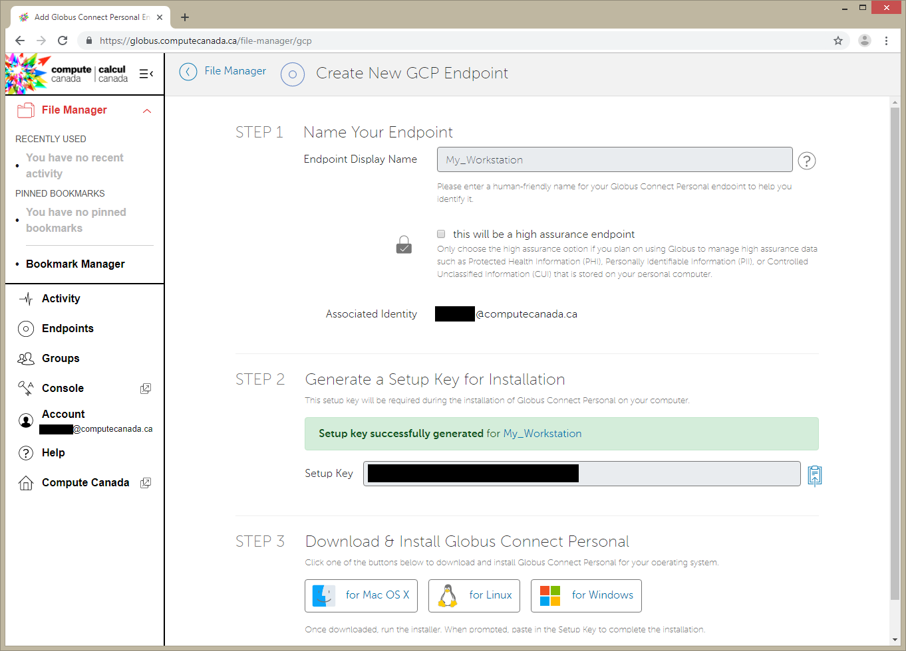
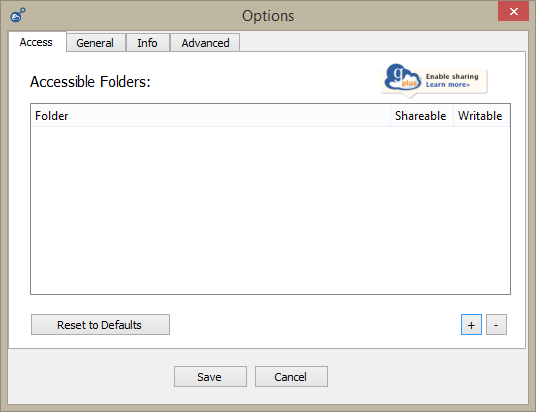
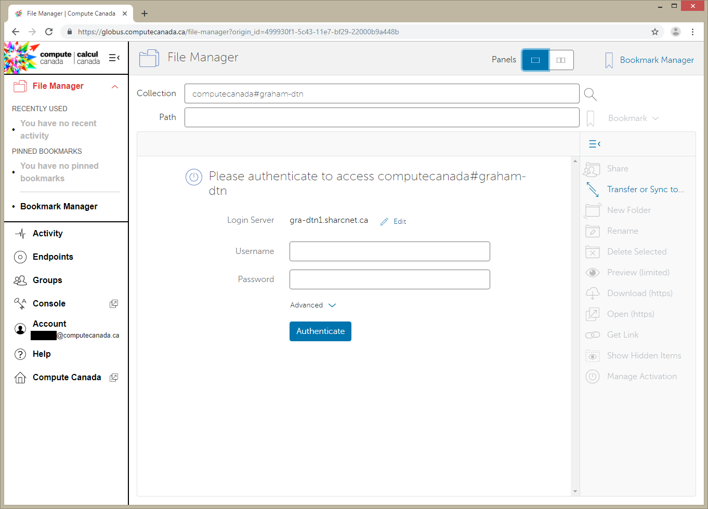
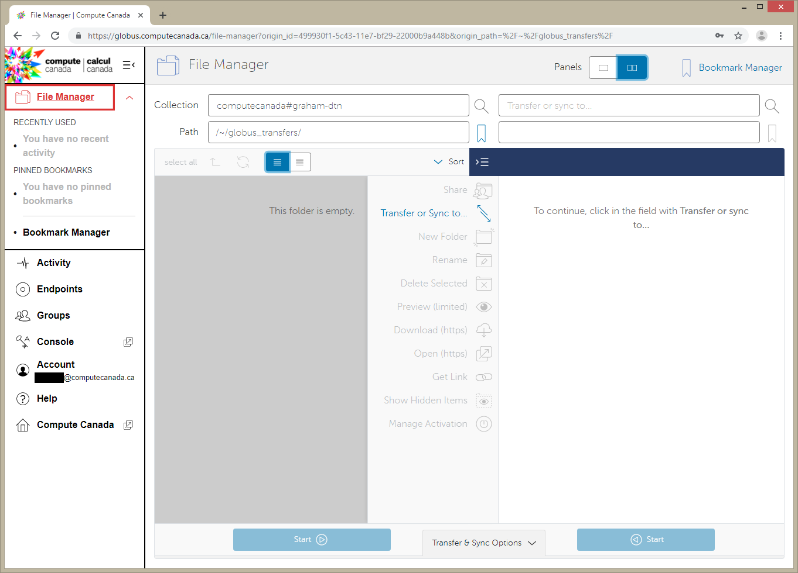
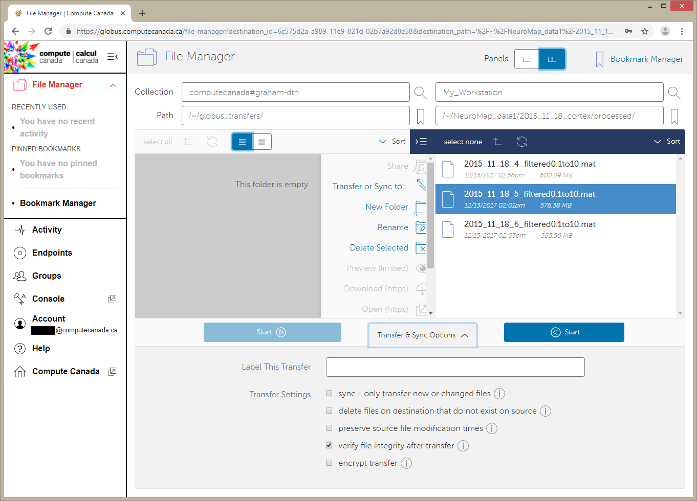
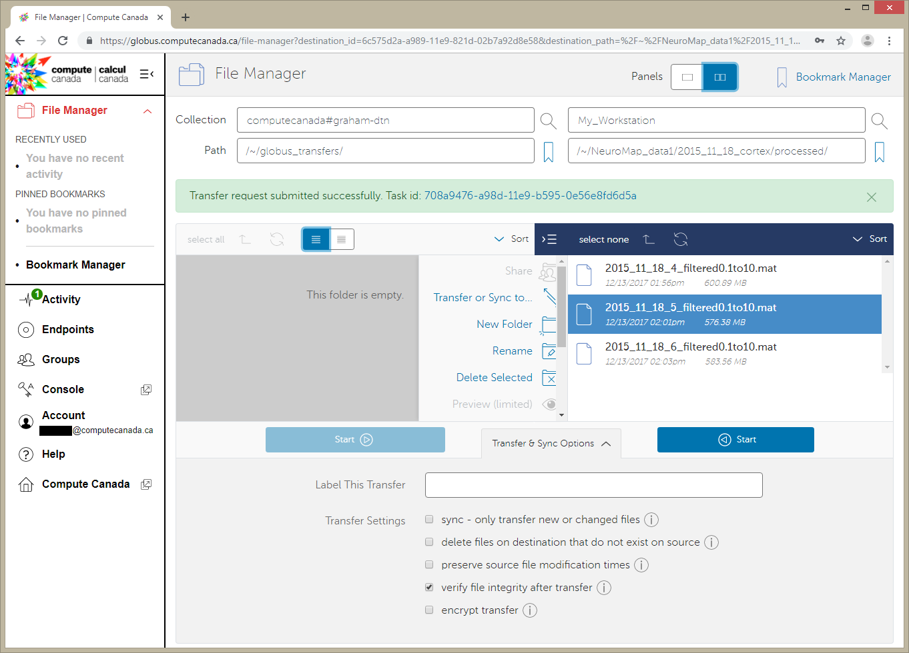

============================================
Data Transfer and Backup on Remote Computers
============================================

This section covers the use of tools like ``scp``, ``Rsync``, ``sftp`` and Globus to make transfers and backups. While the examples place an emphasis on Compute Canada, they can be generalised to apply to any remote computer.

``rsync-time-backup``
=====================
``rsync-time-backup`` is a utility available `here <https://github.com/laurent22/rsync-time-backup>`_ that builds on top of ``Rsync``. 

It allows backups over SSH, backup resumes, uses hardlinks to avoid duplication and provides functionality to create full backups. In short, it can be used to create full snapshots, the frequency of which can be configured e.g. keep each hour of the last 24 hours, each day of the previous month and each month in the previous year.

You may find it useful to combine several techinques in the examples below and in the docmentation of this script.

Example: Backing up to Compute Canada Project Space
---------------------------------------------------
The project space is a great place for:

* Frequent backups
* Internal and external sharing

You may want to tarball collections of small files (multiple files < 100 MB) to keep the file count down and to keep the diretory uncluttered.

.. Note::
   This works if you set up the SSH key on the Compute Canada server

In this example, we are backing up a drive mounted to our system. In this instance, it is a NAS drive, althogh it could be a hard drive or any other external media.

.. code-block:: bash
   
   $ rsync_tmbackup.sh /media/user/data cedar:/home/user/projects/def-pi/data/

You can replace ``cedar`` with ``graham`` or ``beluga`` as required

Example: Backing up to Remote Computer
--------------------------------------
Suppose you have an ``ssh`` machine ``computer.domain.com`` 

.. code-block:: bash
   
   $ rsync_tmbackup.sh /media/user/data user@computer.domain.com:/data/

Example: Backing up using an exclusion list
-------------------------------------------
Suppose you do not want to backup certain directories, files or file types. You must create an exclusion list ``exclude-file.txt``, for instance::

    secrets.txt
    folder1/*
    folder2
    folder3/scratch/
    *.mat*

This will exclude the file ``secrets.txt``, copy the folder ``folder1`` but not its contents, will not copy the folder ``folder2`` or its contents, will not copy the subdirectory ``folder3/scratch/`` or its contents, and will exclude all files with the ``.mat`` extension.

Local machine to external drive

.. code-block:: bash 
   
   $ rsync_tmbackup.sh /home/user /media/user/data/ excluded_patterns.txt

Compute Canada

.. code-block:: bash
   
   $ rsync_tmbackup.sh /media/user/data cedar:/home/user/projects/def-pi/data/ excluded_patterns.txt

Example: Change the Expiration Strategy
---------------------------------------
From the README::

    The default strategy is ``1:1 30:7 365:30``, which means:

    * After 1 day, keep one backup every 1 day (1:1).
    * After 30 days, keep one backup every 7 days (30:7).
    * After 365 days, keep one backup every 30 days (365:30).

To change the strategy to:
After 30 Days, keep one backup every 14 days,

.. code-block:: bash
   $ rsync_tmbackup.sh  --strategy="1:1 30:14 365:30"  /media/user/data cedar:/home/user/projects/def-pi/data/

``STFP``
=========
From the `Compute Canada Documentation <https://docs.computecanada.ca/wiki/Transferring_data>`_::
  
    SFTP (Secure File Transfer Protocol) uses the SSH protocol to transfer files between machines which encrypts data being transferred.

Unlike ``SCP``, ``SFTP`` omes with an interactive prompt.

Dropping into the SFTP Prompt
-----------------------------

.. code-block:: bash

   $ sftp user@remote_hostname_or_ip_address

For instance, 

.. code-block:: bash

   $ sftp john@alder.arc.ubc.ca

If you set up your ``SSH`` key on the remote computer, you won't even need a password.

.. code-block:: bash

   $ sftp cedar

If it worked, you should be in the prompt e.g.

.. code-block:: bash

   $ sftp cedar
   Connected to cedar.
   sftp>

Exiting the SFTP Prompt
-----------------------

.. code-block:: bash

   sftp> exit

   or

   sftp> bye

Help
----

.. code-block:: bash

   sftp> help 

   or 

   sftp> ? 

Navigating the Remote and Local Machines
----------------------------------------
Current working directory
~~~~~~~~~~~~~~~~~~~~~~~~~
Remote Machine

.. code-block:: bash

   sftp> pwd 

Local Machine

.. code-block:: bash

   sftp> lpwd 

List directory contents
~~~~~~~~~~~~~~~~~~~~~~~
Remote Machine

.. code-block:: bash

   sftp> ls 

Local Machine

.. code-block:: bash

   sftp> lls

Change working directory
~~~~~~~~~~~~~~~~~~~~~~~~
Remote Machine

.. code-block:: bash

   sftp> cd <remote dir> 

Local Machine

.. code-block:: bash

   sftp> lcd <local dir>

Make new directories
~~~~~~~~~~~~~~~~~~~~
Remote Machine

.. code-block:: bash

   sftp> mkdir <remote dir> 

Local Machine

.. code-block:: bash

   sftp> lmkdir <local dir>

Transferring File to Remote
---------------------------

.. code-block:: bash

   sftp> put <local file or directory> <new name on remote [OPTIONAL]>

e.g. 

.. code-block:: bash

   sftp> put data.hdf5
   Uploading data.hdf5 to /project/6006382/user/data.hdf5 
   data.hdf5                                    100%   11GB  100.3MB/s   01:50

.. code-block:: bash

   sftp> put data.hdf5 data_20181012.hdf5
   Uploading data.hdf5 to /project/6006382/user/data_20181012.hdf5
   data.hdf5                                    100%   11GB  100.3MB/s   01:50

Transferring File from Remote
-----------------------------

.. code-block:: bash

   sftp> get <remote file or directory> <new name on local [OPTIONAL]>

e.g. 

.. code-block:: bash

   sftp> get data.hdf5
   Fetching /project/6006382/user/data.hdf5 to data.hdf5
   /project/6006382/user/data.hdf5              100%   11GB  100.1MB/s   01:50

.. code-block:: bash

   sftp> get data.hdf5 data_20181012.hdf5 
   Fetching /project/6006382/user/data.hdf5 to data_20181012.hdf5 
   /project/6006382/user/data.hdf5              100%   11GB  100.1MB/s   01:50

``SCP``
=======
From the `Compute Canada Documentation <https://docs.computecanada.ca/wiki/Transferring_data>`_::

    SCP stands for "Secure Copy". Like SFTP it uses the SSH protocol to encrypt data being transferred. It does not support synchronization like Globus or rsync. Some examples of SCP use are shown here.

    SCP supports an option, -r, to recursively transfer a set of directories and files. We recommend against using scp -r to transfer data into /project because the setgid bit is turned off in the created directories, which may lead to Disk quota exceeded or similar errors if files are later created there.

Basic Usage
--------------

.. code-block:: bash

   $ scp <location/file to copy from> <location/file to copy to>

Transferring Files
-----------------

Suppose a folder in your current local working directory is as follows::

    package/
    ├── package
    │   ├── conf.py
    │   ├── __init__.py
    │   ├── models.py
    ├── LICENSE
    ├── README.md
    ├── setup.py
    └── tests
        ├── test_interface
        |   ├── tests.py
        ├── test_models
        ├── run_tests.py

Running this will only copy ``LICENSE``, ``README.md`` and ``setup.py``, and nothing in the other folders or subdirectories

.. code-block:: bash

   $ scp package cedar:/home/user

Running this will copy everything 

.. code-block:: bash

   $ scp -r package cedar:/home/user

.. note::
   
   The above examples will only work if you set up an ssh key on the remote computer

If using the full address of the remote computer, the equivalent examples are:

.. code-block:: bash

   $ scp package username@cedar.computecanada.ca:/home/user

.. code-block:: bash

   $ scp -r package username@cedar.computecanada.ca:/home/user

Transferring between two remote Computers

.. code-block:: bash

   $ scp graham:/home/user cedar:/home/user

.. code-block:: bash

   $ scp username@graham.computecanada.ca:/home/user username@cedar.computecanada.ca:/home/user

Globus
======
Option 1: Globus GUI 
--------------------
.. tip::
   This can be extended to file transfers between personal endpoints and between Compute Canada servers

1. `Log in <https://globus.computecanada.ca/file-manager>`_

2. Click on ``Endpoints``
3. Click on ``Add an Endpoint`` then ``Globus Connect Personal``
4. Enter a name for your endpoint, e.g. ``My_workstation`` in this case. Check the ``This will be a high assurance endpoint`` box if dealing with highly sensitve data

5. Generate the Setup Key and copy it to your clipboard.
6. Using the links at the bottom of the page, install the Globus Connect Personal Client on your machine and follow the on screen instructions
7. Run the client and paste your Setup Key, then click ``OK``

8. Add location(s) of data you want globus to be able to access by clicking on `+`. 

.. tip:: 
    * Ticking `Shareable` will allow outbound transfers
    * Ticking `Writable` will allow inbound transfers

9. Click ``Save`` when done
10. Go back to your browser and click on the ``File Manager`` Tab
11. Search for the Compute Canada server you want ot upoad the files to. In this example, we are using Graham.

12. Log in with you compute canada credentials and click on ``Authenticate``
13. Your Home directory should now be displayed. Navigate to the folder you want to keep the data in. In this example I will use the ``globus_transfers`` directory in my home directory.
14. Click on ``Transfer or Sync to...`` on the right side menu

15. Click on ``Transfer or sync to...`` box. Click on ``Your Collections`` then on your desired endpoint's name.
16. Navigate the directory structure on either endpoint and select the folder(s) or file(s) you want to transfer/sync to the other endpoint. Clicking on Transfer and Sync Options below, you can select a multitude of options for managing the content on the destination endpoint. Click on ``Start`` when done.

17. You should see a message like: ``Transfer request submitted successfully. Task id: <TASK_ID>`` where <TASK_ID> is a system generated hash for your task.

18. The client on our endpoint will handle your transfer and send
you an email when it is done. You can view the status of the transfer in the `Activity` tab
19. Looking at the filesystem on Graham upon completion, we can see
that the file is indeed there:

.. code-block:: bash

   [<user>@gra-login2 globus_transfers]$ ls -lha
   total 555M
   drwxr-x--- 2 <user> <user>    3 Jul 18 14:54 .
   drwx------ 6 <user> <user>   13 Jul 18 14:38 ..
   -rw-r--r-- 1 <user> <user> 550M Jul 18 15:02 2015_11_18_5_filtered0.1to10.mat

Option 2: Globus CLI 
--------------------
Globus offers a command line interface, which is useful for its convenience and for automating transfers and backups. Its documentation is available `here <https://docs.globus.org/cli/>`_.

Option 3: Archeion
------------------
Archeion can be downloaded `here <https://github.com/ubcbraincircuits/archeion>`_.
Requirement: Globus personal must be set up on personal endpoints.
It can be used to script transfers using python and provides functionality that handles 
authentication and transfer management.

Git-Annex
=========
`Git-Annex <https://git-annex.branchable.com/>`_ uses git to create an annex, which presents 
files to the user in a single directory structure, even though the individual files are distributed across 
multiple locations. It can also be confiogured to create a number of copies of a file distributed across 
different annexes. This enables users to remove a local copy while ensuring redundancies are available on 
other storage locations. It is also able to synchronise files across redundancies. 
File versions can be uniquely tracked and referenced using git changeset hashes.

It also comes with a `webapp interface <http://git-annex.branchable.com/assistant/>`_.

.. Note::
   Git-Annex is a powerful tool but requires knowledge of git, UNIX command line and careful scripting to use 
   effectively.

Use Case Demo: Syncing files with Git-Annex using Linux CLI
-----------------------------------------------------------
The following demo was tested on Ubuntu 18.04 LTS

.. note::
   
   sudo priviledges are required to install git-annex

Install the `Git-Annex <http://neuro.debian.net/install_pkg.html?p=git-annex-standalone/>`_ from NeuroDebian.

Create a repository in a location of your preference

.. code-block:: bash
   
   $ mkdir annex
   $ cd annex
   $ git init
   Initialized empty Git repository in /home/user/annex/.git/
   $ git annex init
   init ok

Add file to the repository

.. code-block:: bash

   $ cd /home/user/annex/
   $ cp ~/Pictures/121406.jpg ./
   $ git annex add .
   add 121406.jpg ok
   (recording state in git...)
   $ git commit -a -m added
   [master (root-commit) 1259e1c] added
   1 file changed, 1 insertion(+)
   create mode 120000 121406.jpg

Add a remote, in this case, an external hard drive called 'My Passport'

.. code-block:: bash

   $ cd /media/user/USB\ DISK/
   $ git clone /home/user/annex/
   Cloning into 'annex'...
   done.
   $ cd annex
   # get the desktop and the hard drive to get to know each other
   $ git annex init
   $ git remote add desktop /home/user/annex
   $ cd /home/user/annex
   $ git remote add harddrive1 /media/user/My\ Passport/annex

Now let's add a bunch of files to the Desktop's Annex

.. code-block:: bash
   $ cd /home/user/annex/
   $ cp ~/Pictures/121419.jpg ~/Pictures/121421.jpg ./
   $ git annex add .
   add 121419.jpg ok
   add 121421.jpg ok
   (recording state in git...)
   $ git commit -a -m added
   [master 8a68299] added
   2 files changed, 2 insertions(+)
   create mode 120000 121419.jpg
   create mode 120000 121421.jpg

And now let's add a bunch of other files to the Hard Drive's Annex

.. code-block:: bash
   $ cd /media/user/My\ Passport/annex
   $ cp ~/Pictures/121415.jpg ~/Pictures/121420.jpg ./
   $ git annex add .
   add 121419.jpg ok
   add 121421.jpg ok
   (recording state in git...)
   $ git commit -a -m added
   [master 8a68299] added
   2 files changed, 2 insertions(+)
   create mode 120000 121419.jpg
   create mode 120000 121421.jpg

Looking at the contents of the Desktop annex, we see the following:

.. code-block:: bash

  $ ls
  121406.jpg  121419.jpg  121421.jpg

Looking at the contents of the Hard drive annex, we see the following:

.. code-block:: bash

  $ ls
  121406.jpg  121415.jpg  121420.jpg

Now we need to sync the files and make sure our annexes have the same contents
  
.. code-block:: bash  
  $ cd /media/user/My\ Passport/annex
  $ git annex sync desktop
  $ git annex get .
  $ cd /home/user/annex/
  $ git annex sync harddrive1
  $ git annex get .

Now, looking at the contents of the Desktop annex, we see the following:

.. code-block:: bash

  /home/user/annex$ ls
  121406.jpg  121415.jpg  121419.jpg  121420.jpg  121421.jpg

And also when looking at the contents of the Hard drive annex, we see the following:

.. code-block:: bash

  /media/user/My Passport/annex$ ls
  121406.jpg  121415.jpg  121419.jpg  121420.jpg  121421.jpg

This can be automated as a cron job that syncs your files with your backups in regular intervals

Refer to the `documentation <http://git-annex.branchable.com/walkthrough/#index21h2>`_
to learn more about setting up ssh remotes, removing and transferring files and troubleshooting.

Downloading files from data respositories
=========================================
FRDR
----
FRDR offers the option to download files using globus. Refer to the Globus GUI section above for instrutions on how to download files using Globus.
Globus alkso provides the option of downloading the file(s) using a direct download link.

Direct Downloads
----------------
To download files using a direct downlaod link, for instance, via Dataverse, use ``wget`` or  ``curl``.

Example
~~~~~~~
To download the `Neurophotonics tutorial on making connectivity diagrams from Channelrhodopsin-2 stimulated data <>`_ dataset from Dataverse, using ``wget``

.. code-block:: bash

   $ wget https://dataverse.scholarsportal.info/api/access/datafile/77286?gbrecs=true

Alternatively, you can use ``curl``

.. code-block:: bash

   $ curl https://dataverse.scholarsportal.info/api/access/datafile/77286?gbrecs=true --output download.zip # or whatever you want to call the file you download. Keep in mind the file format.
   
