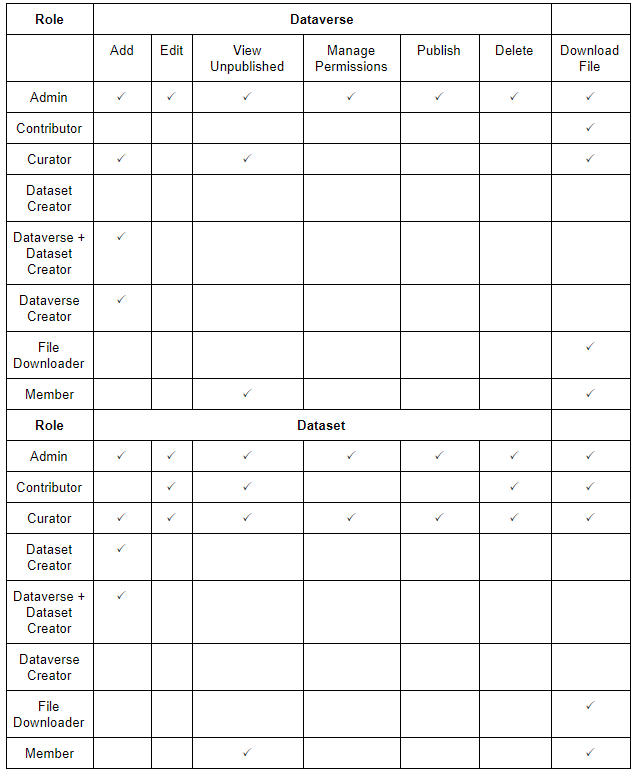

Borealis: The Canadian Dataverse Repository
=========================
`Borealis <https://borealisdata.ca/>`_ is a publicly accessible and secure Canadian 
data repository provided by Scholars Portal on behalf of the `Ontario Council of University 
Libraries (OCUL) <https://ocul.on.ca/>`_ and other participating institutions. Borealis can be used by 
affiliated researchers to deposit, share, and archive research data.

.. tip::
	Consult the `Borealis User Guide <https://borealisdata.ca/guides/en/latest/user/>`_ 
	for more information.

.. attention::
	We are pleased to announced that we have set up 
	a `dataverse <https://borealisdata.ca/dataverse/UBC_BrainCircuits>`_ for the cluster within the UBC dataverse, 
	under which we can set up dataverses for individual labs. 
	
	Contact `Jeffrey LeDue <mailto:jledue\@mail.ubc.ca>`_ to set up a dataverse for your lab.

Storage and Backup
------------------

Location
~~~~~~~~
Borealis is hosted in Canada at the University of Toronto Libraries. 
Although institutional Datavarses can be set up, the data is still stored at this 
data center.

Size Limits
~~~~~~~~~~~

.. attention:: 
	The limit for an individual file upload on Borealis is **2.5 GB**.
	
	There is no set limit on the overall storage per dataverse. 

There are also other considerations to be made when making uploads:

1. When .zip or .tar archives are uploaded, they can be:
 - unpacked, with loss of hierarchy and file organisation. They recommend having fewer than 500 files in each archive due to processing and user experience concerns.
 - packed, maintaining hierarchy and file organisation. To achieve, this, the archive must be zipped or tarballed.

2. Tabular data files (Excel, SPSS, R Data, CSV) should be less than 500MB in size as the processing that takes place at upload time will make the process slow. 

For larger datasets, dataverse support can be contacted at  dataverse@scholarsportal.info. 
However, the recommended next step is to use `FRDR <https://ubcbraincircuits.readthedocs.io/en/latest/data_sharing/frdr.html>`_.

User Permissions
----------------
Users can be granted the following tiered access and permissions:

.. glossary::

	Admin
		A person who has all permissions for dataverses, datasets, and files.

	Contributor
		For datasets, a person who can edit License + Terms, and then submit them for review.

	Curator
		For datasets, a person who can edit License + Terms, edit Permissions, and publish datasets.

	Dataset Creator
		A person who can add datasets within a dataverse.

	Dataverse + Dataset Creator
		A person who can add subdataverses and datasets within a dataverse.

	Dataverse Creator
		A person who can add subdataverses within a dataverse.

	File Downloader
		A person who can download a published file.

	Member
		A person who can view both unpublished dataverses and datasets.
		

*Dataverse roles*

.. note::
	It is recommended that curators are clearly identified in your DMP, as well as guidelines and procedures they 
	should abide by to prevent misuse of permissions.
	
Additional Features
--------------------

*Findability and Reusability*
	Automatically generated DOI and citation (**F** A I **R**).

*Version Control*
	Built-in versioning with ability to view differences.
	
*Metrics*
	Track number of downloads and collect data about users who download files using the Guestbook feature. 
	
*Dataset Template*
	Dataverse provides the following dataset templates:
	
		1. CC Attribution-ShareAlike 4.0 International (CC BY-SA 4.0)
		2. CC Attribution-Non-Commercial 4.0 International (CC BY-NC 4.0)
		3. CC Attribution-NonCommercial-ShareAlike 4.0 International (CC BY-NC-SA 4.0) 
		4. CC Attribution 4.0 International (CC BY 4.0)
	
	The templates contain metadata fields that are prepopulated based on the chosen license.
	
	It is possible to create custom templates so that dataset creators will not have to enter
	values for metadata fields that do not change from dataset to dataset. While it is not possible to create custom fields, 
	there are large selections of metadata fields available in the template creator and the ability 
	to create keywords for other particulars.
	
	Labs are encouraged to create standardized templates for their datasets to ensure all required 
	metadata are captured.
