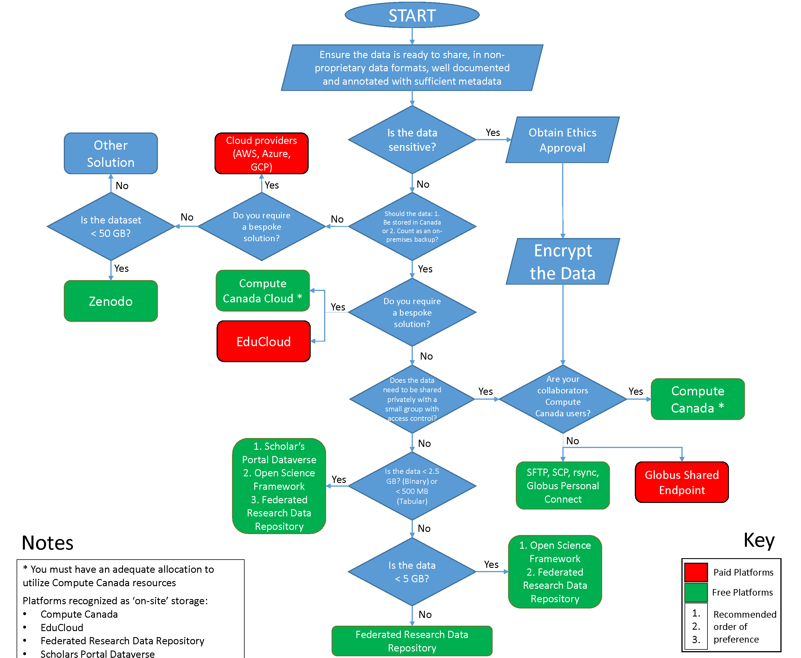

======================
Data Sharing Platforms
======================

It is highly recommended for researchers to share data associated with the findings and results of publications as this promotes the cluster’s aim 
to further engage in open science. In addition to providing a data archival solution whenever appropriate, data sharing platforms have other benefits such as:

* Reduced overall cost of storage - the use most of these platforms are free of charge
* Backups are created by the platforms and data integrity is highly assured
* Meeting data management requirements, such as number of backups, backup location and mode, and long-term preservation
* Embargo features allows fresh data to be backed up and released publicly after publication

The use of APIs provided by these platforms can be used to automate the upload of large quantities of data to these platforms during the initial process of 
archival and standardised in-lab procedures can then be set up to make archival on such platforms a frequent activity.

*Data sharing flowchart*

Recommended Data Sharing Platforms
==================================

.. image:: recommended_platforms.png

.. toctree::	
	:maxdepth: 1

  dataverse 
  frdr 
	sharing_compute_canada
  open_science_framework
  bespoke
  conp

Other Data Sharing Platforms
============================

.. image:: other_platforms.png

.. toctree::	
	:maxdepth: 1
	
  zenodo
  datalad

Discovering Open Data
=====================
The `CONP portal <http://conp.ca>`_ promises to deliver a central repository aggregating metadata from multiple platforms, allowing researchers to discover open data. As the portal is still under development, we have compiled a list of resources that can be used for this purpose:

* `Registry of Research Data Repositories <http://re3data.org>`_ - Discover open data repositories across the globe
* `bioCADDIE <http://biocaddie.org>`_ - Biomedical and healthcare data discovery and indexing ecosystem
* `Federated Research Data Repository <http://frdr.ca>`_ - FRDR crawls through multiple other Canadian data repositories including dataverses, FRDR’s own data and government open data (view a full list `here <frdr.ca/discover/html/repository-list.html?lang=en>`_), allowing users to search for and discover data from multiple sources
* `CRCNS <http://crcns.org>`_ - Collaborative Research in Computational Neuroscience. Hosts data from projects funded by their funding program.
* `Center for Open Neuroscience <http://centerforopenneuroscience.org>`_ -  open software frameworks, platforms, data and methodologies for neuroscience
* `OpenNeuro <http:/openneuro.org>`_ - free and open platform for sharing MRI, MEG, EEG, iEEG, and ECoG data

Lists that have been compiled by other sources:

* `Awesomedata <http:/github.com/awesomedata/awesome-public-datasets#neuroscience>`_ - A list of open neuroscience data platforms
* `Opening up: open access publishing, data sharing, and how they can influence your neuroscience career <http://onlinelibrary.wiley.com/doi/full/10.1111/ejn.13234>`_ - Table 2. Popular data sharing repositories
