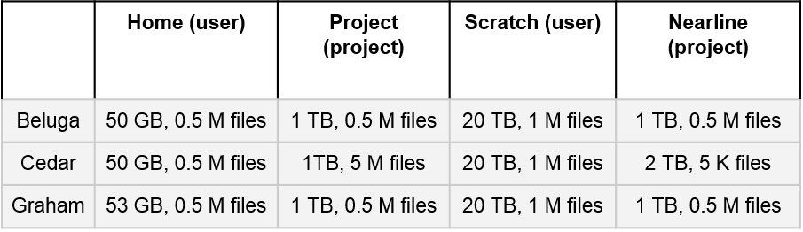

===================
Compute Canada (CC)
===================
Compute Canada is a provider of Advanced Research Computing infrastructure, including systems, storage and software. Their regional partner is `Westgrid <http://westgrid.ca>`_, and they provide additional support.

Compute Canada provides heterogeneous, general purpose clusters and Clouds that allow researchers to access resources such as CPU and GPU time, `software <http://docs.computecanada.ca/wiki/Available_software>`_, as well as different storage systems. A list of the available national systems is found `here <docs.computecanada.ca/wiki/National_systems>`_.

Cost
====
Compute Canada and Westgrid resources can be used at no financial cost to researchers.

Signing up
==========
You can apply for a Compute Canada account following this `documentation <http://computecanada.ca/research-portal/account-management/apply-for-an-account>`_:

* If you are a PI, please create an account as other lab members must be sponsored under your account.
* If you are a lab member, contact your PI for their Compute Canada Role Identifier (CCRI) so that you can complete your application. Your PI must then confirm your role for your account to be created.

Storage Types
=============

* Home: Small fixed quota that cannot be changed. Does not offer high performance read and write speeds. Unique to each user. It is not clear whether this space is backed up. Best location to store smaller files like source code, scripts and configs.
* Project: Larger quota than Home. Resource shared by PI and all users registered under the PI. Details on backups can be found here [docs.computecanada.ca/wiki/Data_backup_and_restoration]. Best location to share files from and for live storage. 
* Scratch: Large quota for each user, ~20TB. For high performance read and write operations. This space is not backed up and is purged at 60 day intervals. Files should only be in stored in scratch when running jobs.
* Nearline: A filesystem virtualized onto tape. Files copied to nearline are transferred to tape. Access speeds are slow as files have to be copied onto disk from tape. Resource shared by PI and all users registered under the PI. Data is not backed up. Best location for data archival.

Security and Status
===================
Compute Canada is considered to be off-site UBC storage as per UBC’s Information Security Standard #03: Transmission and Sharing of UBC Electronic Information Section 11.

Resource Allocations
====================
The following information pertains to the national heterogeneous clusters as at 8th August 2019.

Default Resource Allocations (def)
----------------------------------

* CPU/GPU time is for opportunistic use (no priority is given on the queue). If you require priority, apply to the Resource Allocation Competitions (RAC)
* No Cloud Allocation
* Default storage allocations (`reference <http://docs.computecanada.ca/wiki/Storage_and_file_management/en>`_):

Rapid Access Service (RAS)
--------------------------
From the `CC website <http://computecanada.ca/research-portal/accessing-resources/rapid-access-service>`_::

    Rapid Access Service (RAS) allows Principal Investigators (PIs) to request a modest amount of storage and cloud resources without having to apply to the Resource Allocation Competitions (RAC). 

* CPU/GPU time is for opportunistic use (no priority is given on the queue). If you require priority, apply to the Resource Allocation Competitions (RAC)
* Cloud allocations available

PIs are encouraged to apply for storage through RAS. Details can be found on their website, linked above.

Resource Allocation Competitions (RAC)
--------------------------------------
RAC are held annually each fall and are applied in the following April. and enable researchers to request resources beyond what they can apply for through RAS. Learn more about making an entry `here <computecanada.ca/research-portal/accessing-resources/resource-allocation-competitions>`_:

* CPU/GPU time by priority
* Larger storage allocations
* Larger cloud allocations

Recommended Usage Scenario for Live Storage
-------------------------------------------
The project file system can be used as a backup made at regular intervals such as daily or even every 2 hours. This can be automated as a cron job using shell scripting tools like globus,  rsync, scp or sftp. Documentation on these tools can be found `here <docs.computecanada.ca/wiki/Transferring_data>`_.

Archeion or the Globus API/SDK can be used to script globus transfers.