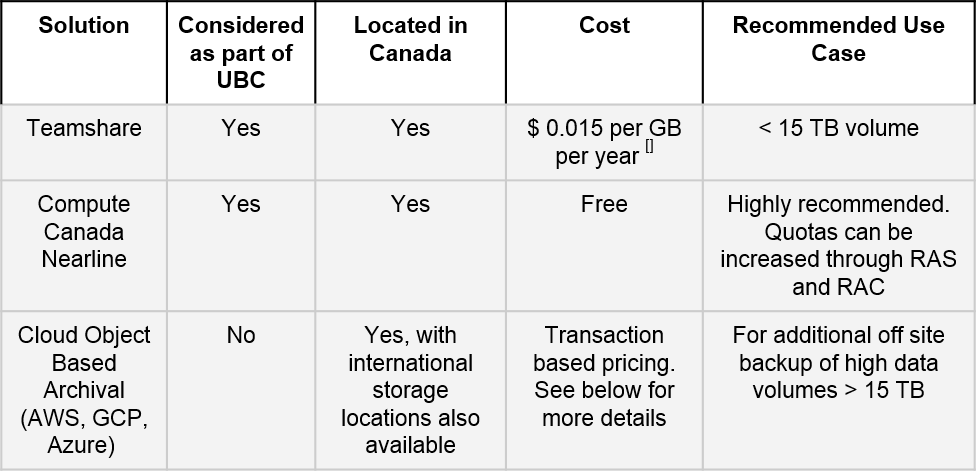

======================
Data Storage Platforms
======================

In this section, we provide overviews and brief evaluations of various storage platforms and technologies.

They are classfiied as follows:

Live Storage
============
Live Data Storage is appropriate for data that is actively changing and is accessed frequently. This typically requires a high performance file system with low wait times and high read and write speeds to support demanding research workflows. They are normally characterised by mid to high storage costs.

.. toctree::
   :maxdepth: 1
   
   teamshare
   compute_canada
   network_attached_storage
   cloud_object_storage

Data Archival
=============
Live Data Storage is appropriate for data that is actively changing and is accessed frequently. This typically requires a high performance file system with low wait times and high read and write speeds to support demanding research workflows. They are normally characterised by mid to high storage costs.

Overview:

.. toctree::
   :maxdepth: 1

   teamshare_archive
   compute_canada_nearline
   cloud_object_archival
   data_sharing_platforms
