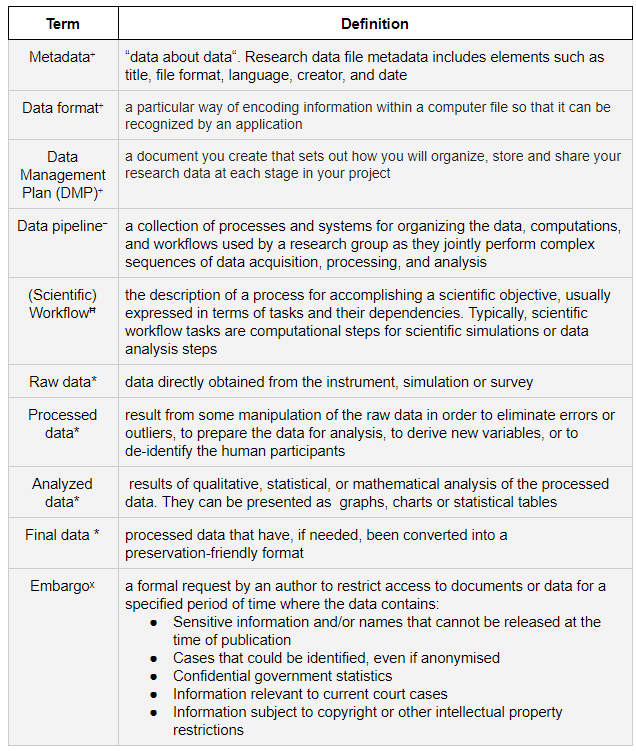

Terms and Definitions 
======================

(*) As defined in the University of British Columbia Generic Template within the Portage DMP Assistant

(ˠ) As defined by the `UBC Library <https://researchdata.library.ubc.ca/>`_

(⁻) As defined by `DataJoint <https://docs.datajoint.io/python/intro/01-Data-Pipelines.html#what-is-a-data-pipeline>`_

(ꟸ) As defined in the document `Scientific Workflows <https://web.cs.ucdavis.edu/~ludaesch/pubs/scientific-workflows-encyclopedia-2009.pdf>`_ by the UC Davis Genome Center

(ˣ) As defined in the `Research Data Management: Publication <http://libguides.library.curtin.edu.au/c.php?g=202401&p=1333346>`_ page of the Curtin University Library website
