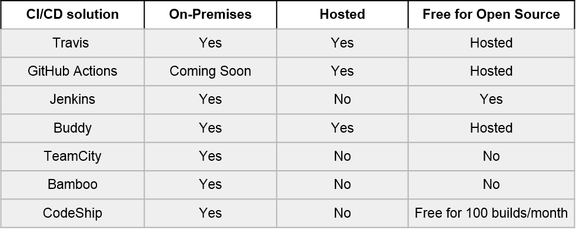

===============================================
Continuous Integration, Delivery and Deployment
===============================================

Continuous Integration
======================
Continuous Integration (CI) involves automating the integration of code from different developers of a centralised codebase managed using a version control system. This includes automated testing of correctness and compatibility of code across different platforms and environments to ensure that changes do not cause failures. 

CI allows teams to enforce the quality and correctness of code quickly and reliably.

Continuous Delivery and Continuous Deployment
=============================================
Continuous Delivery (CD) builds upon CI and involves the automation of software delivery by making new releases available automatically upon approval. 

Continuous Deployment builds upon CD and involves the automation of the approval process.
This allows end users to obtain bleeding edge updates as soon as possible instead of having to wait for a major release and enhances the feedback loop. It also further enforces the quality and reliability of the software.

CI/CD Solutions
===============
Below is a comparison of some popular solutions, using information from the providers’ websites as at the 1st of August, 2019. 

For factors like full control, compliance with hosting policies and privacy of source code, readers may need to consider what solution CI/CD solution is deployed and where. They are also encouraged to conduct their own research into picking the best solutions for their projects.

